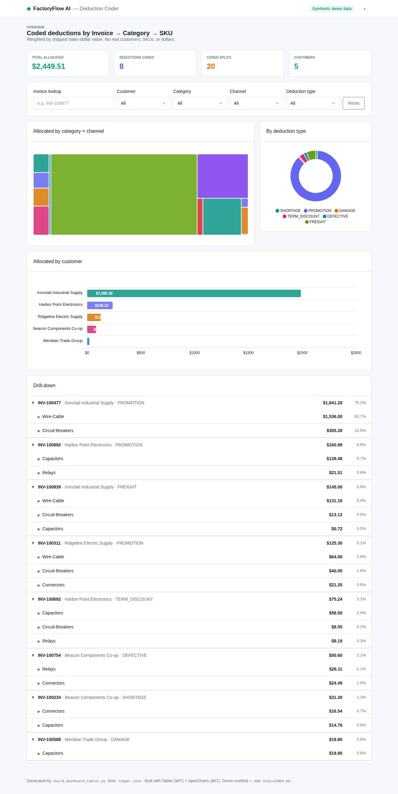
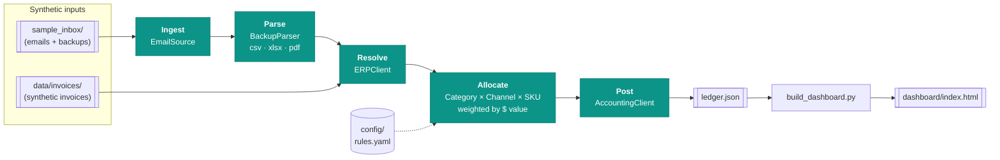
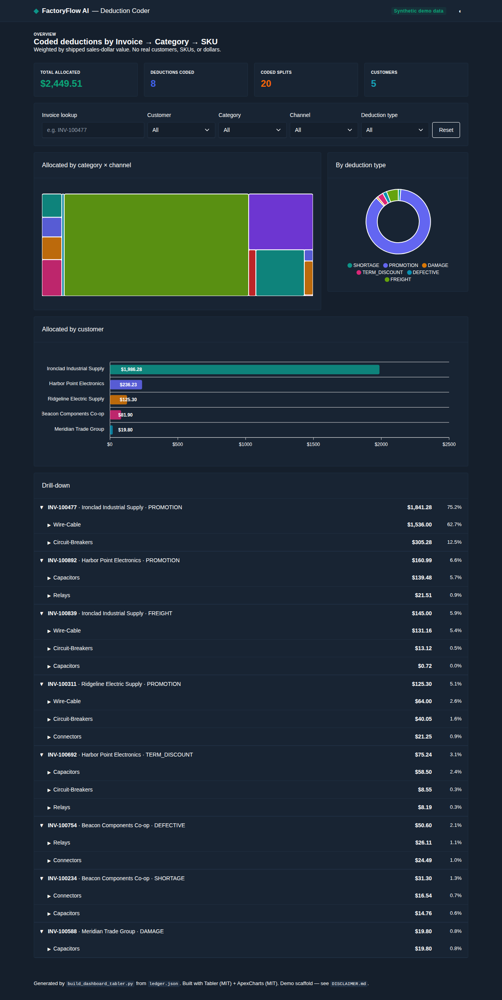
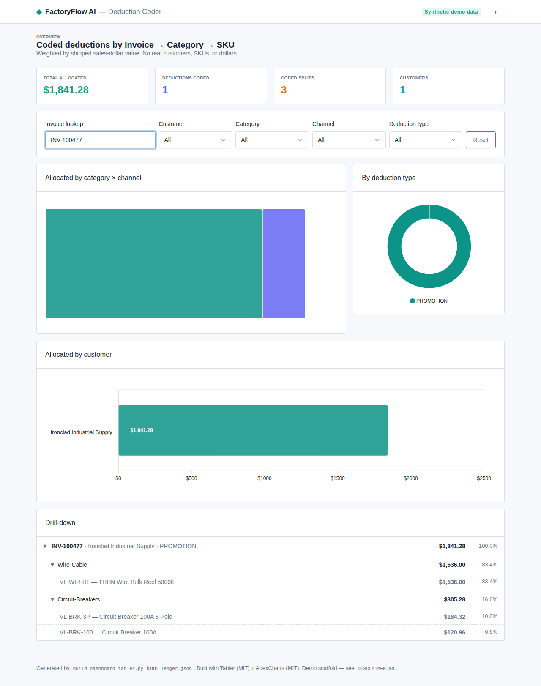

# FactoryFlow AI — Deduction Coder

An **ERP-agnostic, open-source scaffold** that automates *deduction coding* —
the tedious back-office work of taking a customer's short-payment (a
"deduction"), figuring out what it was really for, splitting it across the right
accounting dimensions, and posting it to the general ledger.

It turns this:

> *"Customer paid invoice INV-100234 short by \$412.50 with a PDF backup."*

into this:

> *"\$246.00 → Connectors / Retail (GL 5010), \$166.50 → Capacitors / Retail
> (GL 5900)… posted."*

> ⚠️ **Demo scaffold.** Everything here runs on **synthetic data only** — a
> fictional electrical-parts brand ("Voltline Components"), made-up customers,
> SKUs, and dollars. See [DISCLAIMER.md](DISCLAIMER.md). Handle real financial
> data locally.



## What it does

The pipeline has five obvious, swappable stages:

```
ingest  ->  parse  ->  resolve  ->  allocate  ->  post
```

1. **Ingest** — read an email inbox and pull out deduction backup attachments
   (PDF / CSV / XLSX). *Shell only:* a mock inbox reads from `sample_inbox/`;
   IMAP / Microsoft Graph / Gmail transports are stubbed behind one interface.
2. **Parse** — per-format parsers extract line items (item / UPC / description,
   qty, extended amount) and the deduction total. Three example formats ship
   with synthetic samples.
3. **Resolve** — given the invoice/PO number, fetch the invoice's shipped line
   items from the ERP. `ERPClient` interface + a `MockERPClient`; QuickBooks /
   NetSuite / SAP adapters stubbed.
4. **Allocate ("deduction coding")** — split each deduction across the coding
   key **Product Category × Sales Channel**, down to **SKU**, weighted by the
   sales-dollar value per SKU. Taxonomy, channel rules (including a
   *bulk / industrial* rule), payment-term rates, and GL mapping all come
   from [`config/rules.yaml`](config/rules.yaml).
5. **Post** — write each coded split to the correct GL account.
   `AccountingClient` interface + a `MockAccountingClient` (writes
   `ledger.json`); QuickBooks / NetSuite adapters stubbed.

## Architecture



Every stage is an **interface** (`EmailSource`, `BackupParser`, `ERPClient`,
`AccountingClient`). The mocks make the demo run offline; adopters swap in real
adapters without touching the pipeline or the allocation engine.

## Quickstart

```bash
git clone <your-fork-url> FactoryFlowAI
cd FactoryFlowAI
python -m venv .venv && source .venv/bin/activate
pip install -r requirements.txt

# Run the whole pipeline on synthetic data, then open the dashboard:
python -m factoryflow.demo
open dashboard/index.html        # macOS (use xdg-open on Linux)
```

The demo generates synthetic data on first run, prints a summary, writes
`ledger.json`, and renders **two** dashboards:

- `dashboard-app/index.html` — the richer **Tabler UI** build (recommended)
- `dashboard/index.html` — a **zero-dependency** single-file fallback

```bash
python -m pytest              # run the test suite
python -m scripts.sanitize_scan   # data-safety scan (must exit 0)
python -m scripts.generate_synthetic_data   # (re)generate synthetic data
```

### Requirements
- Python 3.10+
- `PyYAML` (required). `openpyxl` is optional — it enables the `.xlsx` backup
  format; the pipeline simply skips that format if it is absent. PDF parsing
  needs no dependencies (a built-in reader handles the demo's PDFs); set
  `FACTORYFLOW_PDF_BACKEND=pdfplumber` for real-world PDFs.

## How to connect your ERP / accounting

You implement small interfaces and inject them into the `Pipeline`. Full
contracts and API notes are in [AGENTS.md](AGENTS.md). In short:

```python
from factoryflow.config import load_rules
from factoryflow.pipeline import Pipeline

pipeline = Pipeline(
    source=MyImapSource(...),            # implements EmailSource
    erp=MyNetSuiteClient(...),           # implements ERPClient.get_invoice()
    accounting=MyQuickBooksClient(...),  # implements AccountingClient.post_split()
    rules=load_rules("config/rules.yaml"),
    parsers=[MyCustomerParser()],        # optional: implements BackupParser
)
result = pipeline.run()
```

| You want to…                    | Implement                          | Mirror the mock        |
|---------------------------------|------------------------------------|------------------------|
| Read a real inbox               | `EmailSource.fetch_unread()`       | `MockInboxSource`      |
| Support a new backup format     | `BackupParser.can_parse/parse()`   | `VoltlineCsvParser`    |
| Look up invoices in your ERP    | `ERPClient.get_invoice()`          | `MockERPClient`        |
| Post to your GL                 | `AccountingClient.post_split()`    | `MockAccountingClient` |
| Change categories / channels / GL | *(edit `config/rules.yaml`)*     | —                      |

Stub adapters with concrete implementation notes already exist for QuickBooks,
NetSuite, SAP (ERP) and QuickBooks, NetSuite (accounting).

## Configuration (`config/rules.yaml`)

- **`categories`** — map SKUs (by prefix or exact match) to product categories.
- **`channels`** — customer defaults plus SKU-level overrides. The bundled
  *bulk / industrial* rule routes bulk reels, 3-pole gear, and 100A+ breakers
  to the Industrial channel.
- **`payment_terms`** — terms string → discount rate (for term-discount coding).
- **`gl_accounts`** — GL mapping by deduction type, by category|channel, or a
  computed promo account.
- **`allocation`** — weighting basis and cent-accurate rounding options.

## Project layout

```
factoryflow/            # the package
  ingest.py             # Stage 1: EmailSource + MockInboxSource + transport stubs
  parsers/              # Stage 2: BackupParser + csv/xlsx/pdf parsers + registry
  erp.py                # Stage 3: ERPClient + MockERPClient + QBO/NetSuite/SAP stubs
  allocate.py           # Stage 4: weighted Category × Channel × SKU allocation
  accounting.py         # Stage 5: AccountingClient + MockAccountingClient + stubs
  config.py             # rules.yaml loader + resolvers
  pipeline.py           # wires the five stages
  demo.py               # `python -m factoryflow.demo`
config/rules.yaml       # all business rules
sample_inbox/           # synthetic emails + backup attachments
data/                   # synthetic invoices + backup copies
scripts/                # generate_synthetic_data.py, sanitize_scan.py
build_dashboard.py      # zero-dependency HTML dashboard
build_dashboard_tabler.py  # Tabler UI + ApexCharts dashboard
dashboard/              # generated zero-dep index.html
dashboard-app/          # Tabler dashboard + vendored assets/ (tabler, apexcharts)
tests/                  # pytest suite
```

## Dashboards

Two renderers read the same `ledger.json`, both theme-aware with KPIs, an
**invoice lookup** search, filters, and an **Invoice → Category → SKU**
drill-down showing each node's share of total (searching an invoice number
narrows the whole view to that invoice and auto-expands its categories):

**1. Tabler UI** (`build_dashboard_tabler.py` → `dashboard-app/index.html`) —
built with the open-source [Tabler](https://tabler.io) UI kit (MIT) and
[ApexCharts](https://apexcharts.com) (MIT), both **vendored locally** under
`dashboard-app/assets/` (no CDN, fully offline). Adds a category × channel
treemap, a deduction-type donut, and a per-customer bar.

| Light | Dark |
|-------|------|
|  |  |

Invoice lookup — search an invoice number to narrow the whole dashboard to it:



**2. Zero-dependency** (`build_dashboard.py` → `dashboard/index.html`) — a single
self-contained HTML file with no libraries at all (same KPIs, invoice lookup,
and Invoice → Category → SKU drill-down). A minimal fallback for environments
where you don't want vendored assets.

### Live demo via GitHub Pages
A workflow at [`.github/workflows/pages.yml`](.github/workflows/pages.yml) runs
the demo, scans for data safety, and publishes the Tabler dashboard
(`dashboard-app/`). Enable it under **Settings → Pages → Source: GitHub Actions**.

## License
[MIT](LICENSE). See [DISCLAIMER.md](DISCLAIMER.md) for data-handling guidance.
